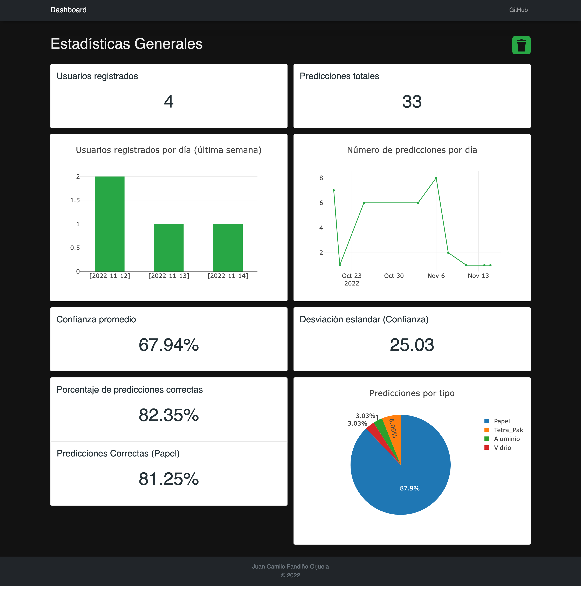

# Proyecto Final Sistemas de Información
### Juan Camilo Fandiño Orjuela

## Introducción
Este proyecto es una aplicación web cuyo proposito es llevar un control del aplicativo Smart-Classifier permitiendo visualizar la cantidad de usuarios registrados en la plataforma, la cantidad de usuarios que han realizado una clasificación y la cantidad de clasificaciones realizadas por cada usuario, entre otra información relevante.

Finalmente, esto permitirá a los administradores de la plataforma tener un mejor control de la misma y poder tomar decisiones más acertadas.

## Herramientas
* [Python](https://www.python.org/)
* [Flask](https://flask.palletsprojects.com/en/2.0.x/)
* [SQLAlchemy](https://www.sqlalchemy.org/)
* [MySQL](https://www.mysql.com/)
* [Plotly](https://plotly.com/)

