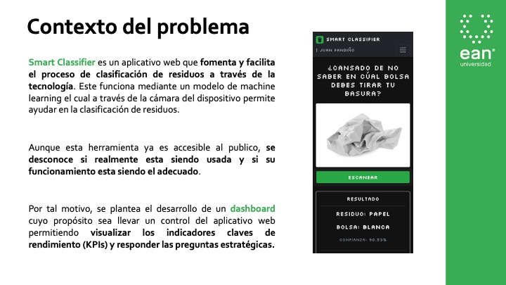
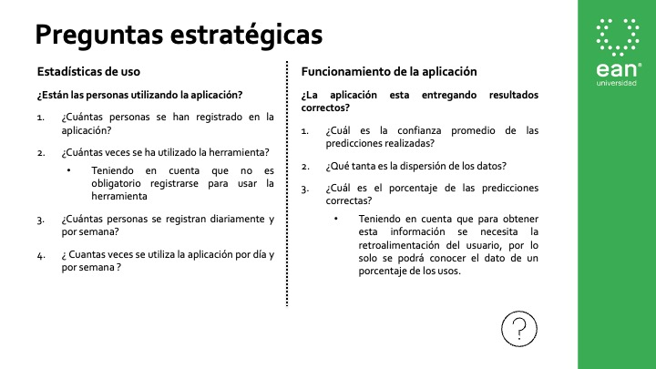
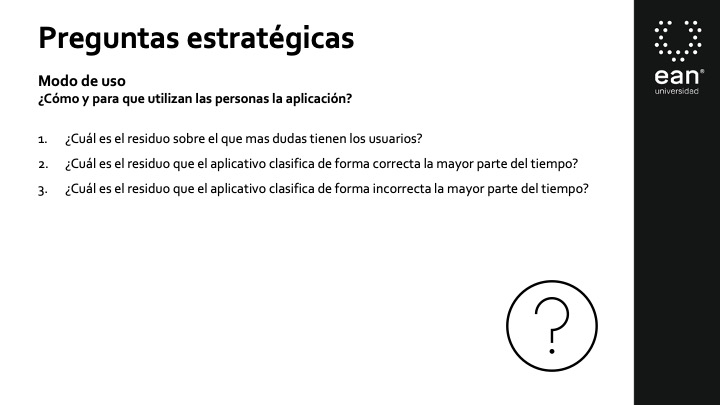
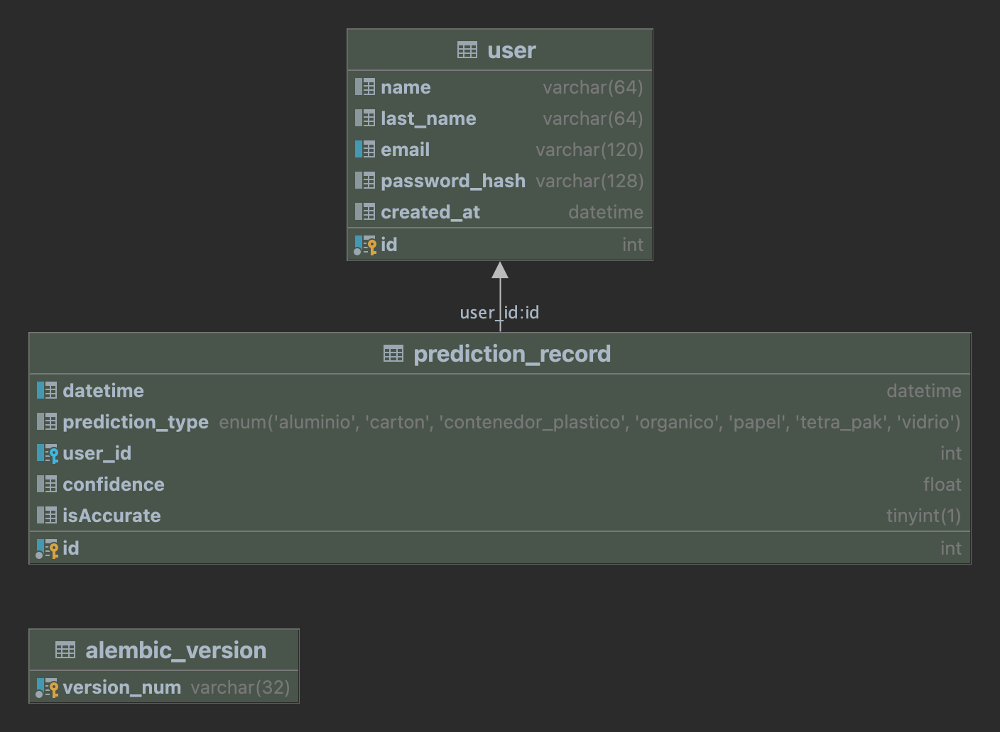
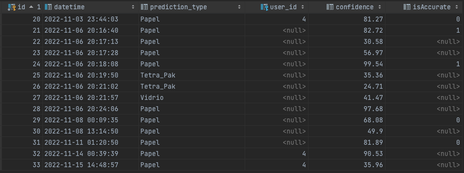
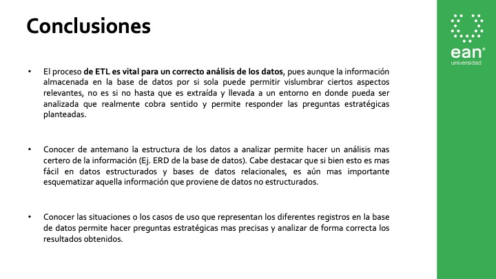

# DASHBOARD PARA LA EVALUACIÓN DEL APLICATIVO WEB “SMART CLASSIFIER”

### Proyecto Final Sistemas de Información

#### Juan Camilo Fandiño Orjuela

## Introducción

Este proyecto es un dashboard web cuyo proposito es llevar un control de la aplicación "Smart Classifier" permitiendo
la visualización de los datos mas relevantes de la herramienta, como el número de usuarios registrados, 
el número de predicciones realizadas, entre otros KPIs que permiten tener un panorama general de la aplicación.

## Herramientas

* [Python](https://www.python.org/)
* [Flask](https://flask.palletsprojects.com/en/2.0.x/)
* [SQLAlchemy](https://www.sqlalchemy.org/)
* [MySQL](https://www.mysql.com/)
* [Plotly](https://plotly.com/)

## Contexto del Problema

## Preguntas Estratégicas

## Muestra de datos y análisis

## Conclusiones

